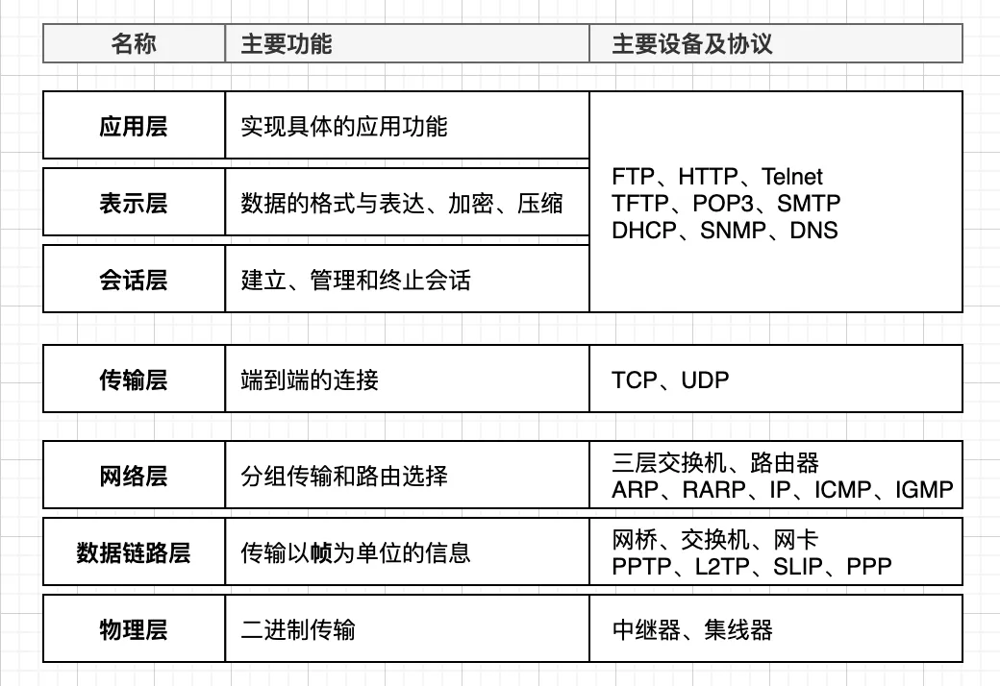
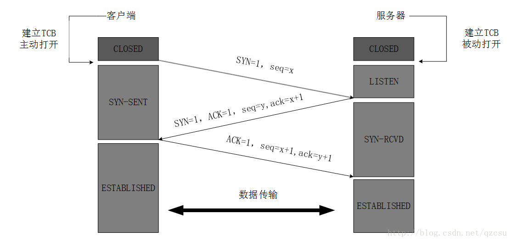
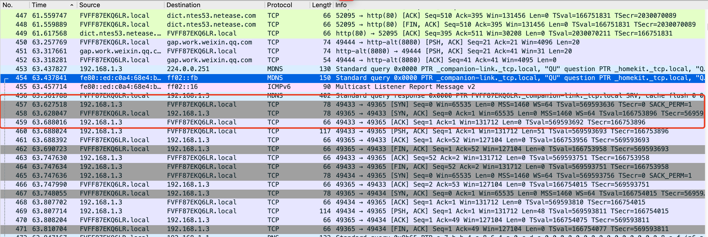
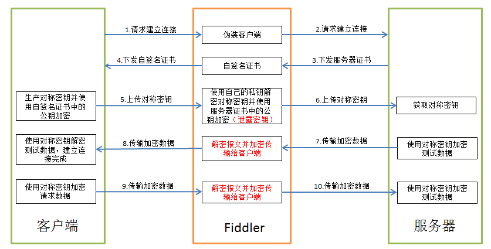

## 什么是包？

  在继续本文之前，让我们首先讨论一下“包”的含义。如果你有网络方面的相关知识，那么你一定熟悉网络的OSI模型:

  该体系结构标准定义了网络互联的7层结构，分别为:

  

  那么，当网络上的两台设备想要通信时会发生什么呢?让我们以一个客户端为例，它希望访问web服务器上的特定页面。从高层来看，客户端将对web服务器上的特定页面发出HTTP请求。

  然而，为了将HTTP请求发送到服务器，数据需要跨OSI模型的各个层进行“封装”。例如，HTTP请求将封装在TCP报头中，然后是IP报头，然后成为以太网帧，直到通过有线发送到服务器。然后服务器将执行相反的过程(解封装)，直到它从客户端检索HTTP请求并进行处理。

  当然这只是一个非常简单的阐述。实际上在发送HTTP请求之前，也会进行其他形式的通信，如ARP和TCP的三次握手。

  在大多数情况下，客户端和服务器之间会发送几个“数据包”，形成这些设备之间的通信/对话。抓包所做的是捕获组成会话的每个包，以便可以更深入地研究这些包。

      注意:在网络术语中，我们称传输层的数据为段，网络层的数据为包，数据链路层的数据为帧。然而，当谈到数据包捕获时，“数据包”指的是在上层(如应用层)封装的数据，一直到数据包准备退出/进入某个接口。

## 抓包

  抓包（packet capture）就是将网络传输发送与接收的数据包进行截获、重发、编辑、转存等操作，也用来检查网络安全。

## 抓包的主要作用

  在了解了抓包的定义后，让我们讨论一下抓包的一些应用场景以及我们为什么要抓包。

  * 网络故障解决及维护

    抓包可以让你了解网络执行过程，从而帮助你对故障进行排除。

  * 识别安全威胁

  * 开发者良好的调试工具

  * 学习

    我们在学习网络方面的知识的时候一般都比较偏向理论，虽然我们知道他的一些流程，但是数据的流向是这么样的，在每一个阶段数据具体发生了什么可能是不知道的。比方说，我们都知道HTTP的三次握手，三次握手是由三个包组成的:SYN, SYN+ACK, ACK, 但是你看过他们具体是怎么样的吗？通过捕获通过TCP进行通信的设备之间的数据包，我们可以学习和查看TCP握手过程。

    

    下图是我用wiresharks看到的三次握手的主要过程：

    

## 常用抓包工具

  * [Wireshark](https://www.wireshark.org/)

    wireshark是非常流行的网络封包分析软件，功能十分强大。可以截取各种网络封包，显示网络封包的详细信息。wireshark能获取HTTP，也能获取HTTPS，但是不能解密HTTPS，所以wireshark看不懂HTTPS中的内容。总结，如果是处理HTTP,HTTPS 建议使用Fiddler, 其他协议比如TCP,UDP 就可以用wireshark.

  * [Fiddler](https://www.telerik.com/fiddler)

      Fiddler是一个用于HTTP调试的代理服务器应用程序，最初由微软Internet Explorer开发团队的前程序经理Eric Lawrence编写。Fiddler能捕获HTTP和HTTPS流量，并将其记录下来供用户查看。

  * [tcpdump](https://www.telerik.com/fiddler)

      比Wireshark更老的工具是tcpdump，它也可以用于抓包和分析。tcpdump只能在包括Mac在内的unix系统上运行。与Wireshark不同，tcpdump是一个严格意义上的命令行工具，开销非常低。

  * 浏览器自带的“开发者工具”

## Fiddler

  * Fiddler官网: [Fiddler官网](https://www.telerik.com/fiddler)

  * Fiddler下载地址: [Fiddler下载地址（mac)](https://www.telerik.com/fiddler/fiddler-everywhere)

  * Fiddler的原理

    Fiddler是位于客户端和服务器端之间的HTTP代理，它能够记录客户端和服务器之间的所有 HTTP(S)请求，可以针对特定的HTTP(S)请求，分析网络传输的数据，还可以设置断点、修改请求的数据和服务器返回的数据。Fiddler在浏览器与服务器之间建立一个代理服务器，Fiddler工作于七层中的应用层，能够捕获通过的HTTP(S)请求。Fiddler启动后会自动将代理服务器设置成本机，默认端口为8866。数据传递流程大致如下：
  

  * 客户端像WEB服务器发送HTTP(S)请求时，请求会先经过代理Fiddler代理服务器。
  * Fiddler代理服务器截取客户端的请求报文，再转发到WEB服务器，转发之前可以做一些请求报文参数修改的操作。
  * WEB服务器处理完请求以后返回响应报文，Fiddler代理服务器会截取WEB服务器的响应报文。
  * Fiddler处理完响应报文后再返回给客户端。

  fiddler 的https原理：
  

## Fiddler的使用

  * 检查器(Inspector)
    Fiddler的检查器(Inspector)会在Live Traffic列表中显示所选会话的请求和响应。
  
  * 编辑器(Composer)
    这个功能类似Postman，我们可以在Composer对请求进行编辑。Composer选项卡允许您手动创建、编辑、发送和测试HTTP和HTTPS请求。您可以从头创建一个新的请求，或者编辑一个已经被Fiddler捕获的请求。

  * 自动应答器(Auto Responder)
     Auto Responder是Fiddler最强大的功能之一。它能够创建将自动触发以响应请求的规则。该功能提供了一种方法，可以在不更新产品服务器的情况下轻松快速地测试对web代码的更改，重现以前捕获的bug，或者在完全脱机的情况下运行网站演示。
  

## [中间人攻击(MitM)](https://developer.mozilla.org/zh-CN/docs/Glossary/MitM)

  * 中间人攻击

    中间人攻击（Man-in-the-middle attack，MitM）会在消息发出方和接收方之间拦截双方通讯。举例来说，路由器就可以被破解用来进行中间人攻击。  

## 总结
  总体来说我感觉Fiddler还是非常好用的，对前端开发来说，我们用它来查看请求，调试接口，Mock数据等。它是非常好的HTTP(S)抓包工具，十分推荐大家调试的时候使用。

## 参考

* [Packet Capture – What is it and a How-To Guide](https://www.pcwdld.com/packet-capture)
* [Fiddler](https://www.telerik.com/fiddler)
* [Fiddler抓包原理和使用详解](https://www.cnblogs.com/sucretan2010/p/11526467.html)

