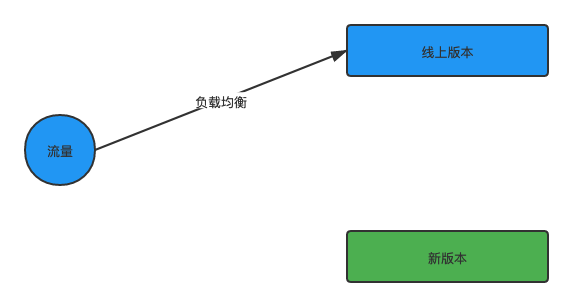
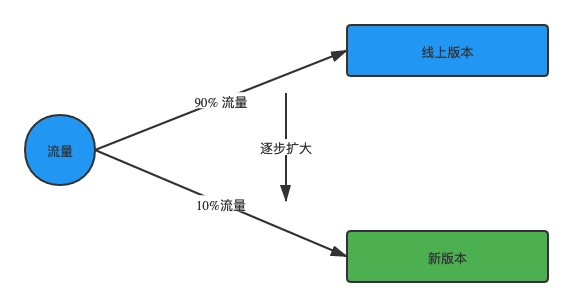

在项目迭代过程中，迭代产物必然需要上线。为了提高应用生产的可用性和可控性，一个好的发布机制对于复杂度较高的业务意义重大。

# GMTC观后感——前端灰度监控与变更防御

## 目录

-   发布种类
-   参考

## 发布种类

在项目迭代过程中，迭代产物必然需要上线。为了提高应用生产的可用性和可控性，一个好的发布机制对于复杂度较高的业务意义重大。
部署有很多策略供选择，有些复杂，有些简单，有些需要停机，有些不需要停机就可以完成部署。下面介绍几种常见的发布策略。

## 蓝绿部署

蓝绿部署中，绿色代表代表正在给用户提供正常服务的系统；蓝色代表另外一套准备发布的系统，还未对外提供，可以做线上测试。

两套套系统必须有相同的基础设置和配置环境，绿色系统测试通过，达到上线标准，就把蓝色系统的流量全部切到绿色系统中，一旦绿色系统出现问题，把所有流量切回到蓝色系统中，待绿色系统稳定后就成为新的蓝色系统，之前的蓝色系统资源就可以释放用于下一个绿色系统，依次循环。

蓝绿部署优点：

* 无停机时间，可在短时间内完成切换
* 能快速回滚，当新特性不能满足预期时，我们只需要将流量切换回环境的前一个版本
* 蓝绿部署可以提高灾难恢复能力，当一个环境中出现问题时，我们可以快速切换到另一个可用环境。实际上，每个版本都相当于一个灾难恢复开关。

蓝绿部署不足：

* 资源利用率不足，一般资源处于空闲状态
* 在切换版本之后，可能仍有业务逻辑在后端处理，因此需要其他机制。比方说你要确保这两个环境在设计时可以同时处理事务，或者在流量切换前将服务设置为只读模式，流量切换后将服务设置为读写模式等等。
* 新版本和旧版本可能涉及对数据库表结构的更改，我们需要额外的数据库兼容性措施。当切换到一个新的环境时，由于新的逻辑，可能会有数据差异。为解决此问题，可以将数据库重构与应用发布分离:首先进行数据库重构，以确保新旧版本之间的兼容性，数据库重构完成后再进行应用发布。

蓝绿部署能够简单快捷实施的前提假设是目标系统是非常内聚的，如果目标系统相当复杂，那么如何切换、两套系统的数据是否需要以及如何同步等，都需要仔细考虑。

## 灰度发布 / 金丝雀发布

灰度发布，又叫金丝雀发布。

以前，旷工在下矿洞是面临的一个重要危险是矿井中的毒气，他们想到一个办法来辨别矿井中是否有毒气，矿工们随身携带一只金丝雀下矿井，金丝雀对毒气的抵抗能力比人类要弱，在毒气环境下会先挂掉从而起到预警的作用。

灰度发布指的是通过更新少量服务器或者将流量进行分流，比如先灰度10%，经过一段时间没有问题后逐步扩大灰度比例，直至全部过渡到新版本。如果在灰度过程中发现问题，可以进行回滚，到稳定版。在出现问题的时候，只会影响少数用户，适用于新功能不可靠或服务可用性较高的场景。

发布过程中，需要有一些流量控制的策略跟随部署的过程，一般可以在负载均衡、路由、应用程序中做处理。

针对用户级别分流。比如先部署给内部用户，在逐渐根据外部用户的分类等级扩散。地域、IP 级别分流。只部署新版本到某地理地域，慢慢扩大到全量发布。

## A/B Test

A/B测试不是蓝绿色部署。A/B测试是一种测试应用功能的方法，测试的原因有很多，比如可用性、受欢迎程度、显著性等，以及这些因素是如何影响利润的。它通常与应用程序的UI部分相关联，但当然后端服务需要可用来做到这一点。可以通过应用程序级开关(即知道何时显示某些UI控件的智能逻辑)、静态开关(在应用程序中)以及使用灰度来实现这一点。

蓝绿色部署和A/B测试的区别在于A/B测试是用来衡量应用的功能。蓝绿色部署是关于安全发布新软件和可预测的回滚。显然，你可以将它们结合起来:使用蓝绿部署来部署应用中的新功能，以便用于A/B测试。

## 滚动发布

滚动部署是一种部署策略，它通过完全替换运行应用程序的基础设施，慢慢地用应用程序的新版本替换以前的应用程序版本。例如，在云主机滚动部署中，运行以前版本的应用程序的容器将被运行新版本的应用程序的容器逐个替换。

滚动部署通常比蓝/绿部署更快;但是，与蓝/绿部署不同，在滚动部署中，新旧应用程序版本之间没有环境隔离。这使得滚动部署可以更快地完成，但如果部署失败，也会增加风险并使回滚过程复杂化。

## 总结

无论使用哪种部署策略，这些策略都是可以实现的。场景不同，所用的策略也不同，可以根据自己业务需要去选择到底使用哪种部署策略。不难想象，通过Docker和Kubernetes这样的技术对于实现这些策略非常有帮助。

## 参考

  * [Grayscale deployment, rolling deployment, and blue-green deployment](https://www.programmersought.com/article/30621734466/)
  * [大厂常用的几种灰度发布方案](http://www.myzaker.com/article/603322478e9f0970e92d52fe)
  * [前端工程化：构建、部署、灰度](https://zhuanlan.zhihu.com/p/71562853)

