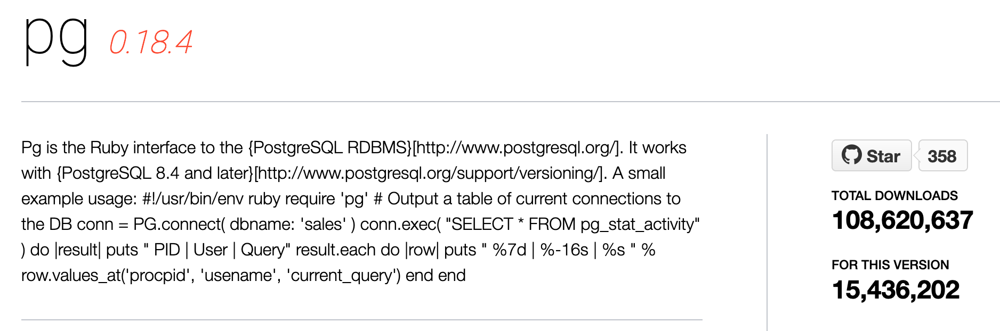
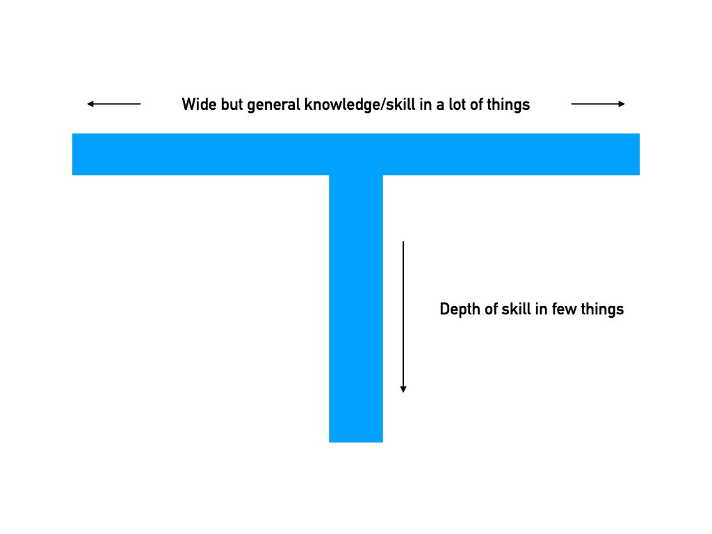
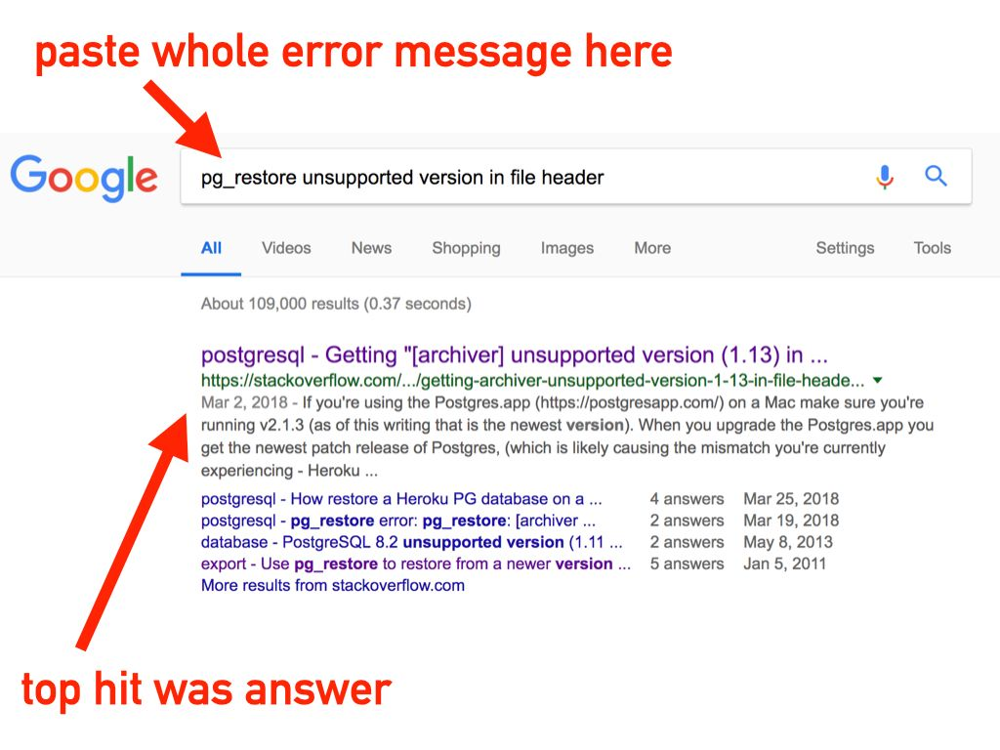
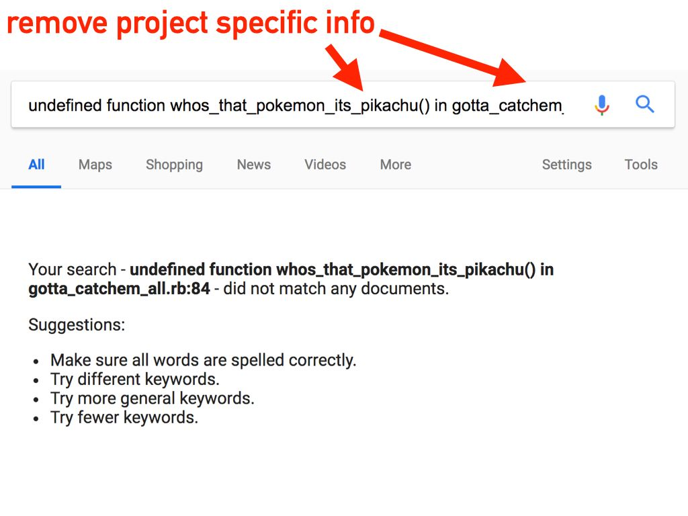
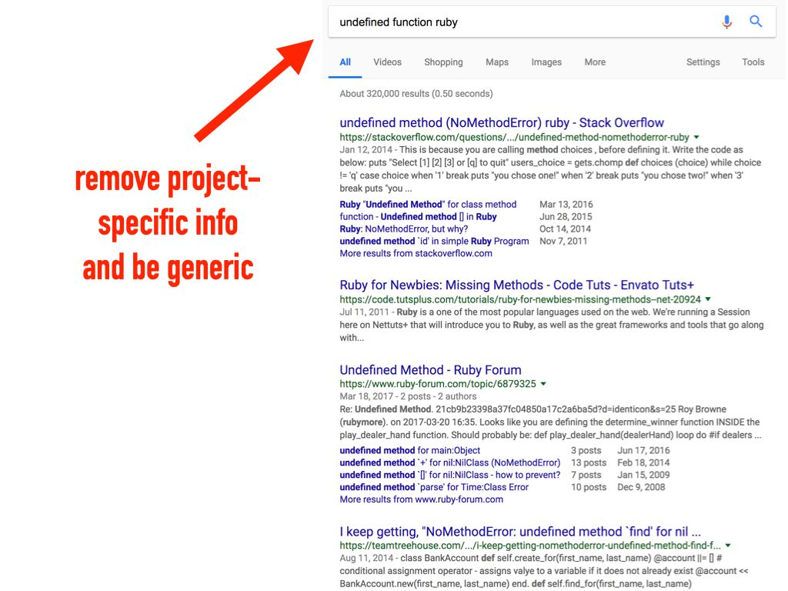
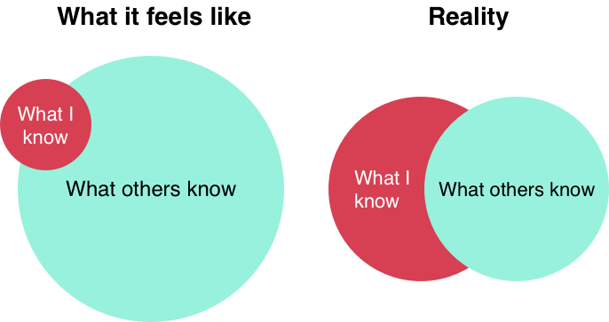

## 前言

  如果你正在阅读这篇文章，你可能刚刚开始做第一份工作——祝贺你，获得第一份工作是你在技术路上遇到的最为困难的事情之一，你一定为此付出了很多努力。

  或许你还没有工作，但是你想了解可以从第一份工作中期待些什么。

  不管怎么样，在这篇文章中我将阐述一些常见的担忧和问题，比如在工作中应该期待什么，以及怎样在事业上成为一名成功的开发者。

  以下是我们将要讲的内容：

    1.在工作中可以期望什么（前几天/几周）

    2.你的短期到中期计划

    3.成功的心态

    4.如何成为一名优秀的初级开发者

## 在工作中可以期待什么

  这一天终于到来了，你第一次作为一名新的开发者走进办公室（或者参加早会）。即使你很紧张，也要记住和适应你的第一天。这是非常激动人心的时刻！

  你工作的第一天很可能做流程上的事情：配置电脑，适应和培训，和一些人力资源方面的事情（如银行信息，保险等）。

  让新开发者在第一天就向产品中 push 一个小实践是一种常见的做法。通常是一些小的任务，比如在公司网页上添加自己的名字和照片，或者修复网页中的一个错字。这会测试你的计算机环境是否配备良好，给你一点成就感，以及让你参与到开发团队中。

## 你的公司希望你成功

  对于一名新入职的开发者，录用你的公司知道你目前的知识和技能的局限，他们知道为了你的成长，他们需要投入大量的时间去教你和训练你。

  记住，公司想要你成长！他们站在你这边，会投入大量的精力来发现、面试、录用你。对公司来讲，无论是在时间和金钱上都是一个昂贵的过程。他们不会把你晾到一边——那将是他们投资你的一种糟糕的方式。有些技能你一开始就能掌握，但是有些技能在专业环境之外获取是非常困难的（也不是不可能）。

  既然这是你的第一份工作，可能你从来没有与使用源代码管理工具或者维护生产应用程序的大团队合作过——没有关系！这些技能在生产环境中是很容易学到的。

## 你的第一天/周

  当你的电脑设置好了，你可以使用所有你所需要的工具。你的第一个任务可能是改进一个小功能或者处理一个小 bug，这些只是让你在不同的项目中试水。

  除了纯粹的技术知识之外，每个公司都有你需要掌握的领域知识或者“业务逻辑”（公司做什么产品或服务，以及是如何做的）。

  如果公司有多种产品，他们可能会在每个源代码中给你一些小任务让你去探索这些产品。可能他们会在团队中给你分配一个带你或者至少在前几周为你解答问题的导师。

  在最初的几周里，你只有一个目标：学习，学习，再学习。

  学习你正在使用的技术，学习公司是如何运转的，学习怎样和你团队的成员协作。在这一阶段你的工作产出不重要，重要的是你的成长速度。

## 接触生产源代码

  当你开始接触公司的代码库，你可能会觉得非常困难。这是非常正常的——写代码比读代码容易得多。

  生产代码跟你学过的教程或者练手的项目有很大不同。

  首先，生产代码可能存在了数年，期间由不同的人进行开发，他们有自己的编程风格并且犯过不同的错误。

  此外，软件依赖或者插件可能比你以前遇到的更多，你可能需要处理一些教程文档中没有讲过的不常发生的事例（比如错误处理）——这是一个真正的应用程序。

  一开始你可能会不知所措，但是阅读别人的代码是你必须提升的技能，你会在你的整个职业生涯中用到它（在文章末尾，我会给你一些关于此技能的建议和帮助）。

  最后，不要害怕寻求帮助！你的同事会支持你，在过去的某一个时候，他们可能也在问相同的问题。

## 对于新开发者的期待

  首先，公司并不会指望你能够迅速适应，去开发新功能。他们知道你需要时间去学习你还没有掌握好的技术，比如熟悉源代码，如何有效进行团队合作。

  你的领导可能会与你碰面来制定 30/60/80 天计划，如果他们不这样做，你可以主动询问！任何领导都会欣赏你拥有自己的工作规划。

  在起初 30 天，你可能通过写一个小需求或者处理一些小 bug 来熟悉公司产品和代码。60 天的时候，你可能会做稍微大一点的功能以及 bug 修复。到 90 天的时候，范围会扩大一点，但是他们还是不会期望你独自负责大的功能。

  公司希望你能不断学习和吸收身边的信息。你不可能什么都知道，也不可能在 90 天后都知道，没关系，一天天慢慢来。

## 新开发者的思维模式

  进入一家新的公司，有很多东西你没法控制，但是有一个你可以控制的非常重要的事情，那就是你的心态。 你每天所想、实践以及你如何内化发生在你身边的事情将决定你的成功。

  有时候你会困惑，有时候你会感到不知所措，有时候你甚至会怀疑你是否能做到（我确实这么想过）。你如何消化这些想法很重要。记住，这些问题不仅只有你会遇到，所有新开发者都要面对。保持冷静，你会成功的。当你遇到令你困惑或沮丧的事情时，端正你的想法：这个障碍是一个学习的机会。

  这是一个了解新事物和成长的机会。在这个过程中你可能会很痛苦，但不久之后，你会成为一名好的开发者。这就是在面对新事物时需要面对的现实。

  不要说：

    “我今天被困住了 10 次”

  而应该尝试说：

    “今天我有 10 次学习的机会”

  这是非常有力的转变，你的同事会看到，你的工作表现也会证明。

  保持头脑清醒，不要让失败的感觉悄悄潜入，这不仅能帮助你在这种情况下表现得更好，而且还能在你摆脱这种情况时增加你的知识和技能。深呼吸，放轻松，寻求帮助并坚持下去。

  在一天结束的时候，轻松地耸耸肩。在当天你离开办公室或者关闭电脑的时候，把它忘了。开始全新的第二天，准备迎接新一天的挑战。

  还有，记住庆祝一路走来的小的成功！随着时间的推移，这些小成功会积累成为巨大的成功之山。

  还有一件重要的事情你要记住：给你自己犯错误的空间。你会搞乱代码，你会做一些糟糕的数据库更新（我就犯过这种错）——这些都是可以恢复的，不是世界末日，也不是你工作的结束。任何有经验的开发人员都会犯这些错误，这只是过程的一部分。

## 新开发者的思维模式

  你可能没有意识到，作为一名新的开发人员，最好的技能是学习如何去学习。

  你已经学会了如何处理困难、复杂、模糊的问题，并将它分成块，一步一步地解决。

  无论你学 JavaScript、React、Ruby 或者其他任何东西，你学到最好的事情是如何自学。多利用你掌握的这个技能并每天都实践它。

## 拥抱自己的成长

  对于处于职业生涯任何阶段的开发人员来说，这可能是最重要的：你的事业是你自己的，你必须拥抱它，你必须管理自己的成长。

  有时你的公司、职位或老板会帮助促进你成长，但最终还是取决于你。大多数公司都有某种固定的审查程序，可能是季度或年度。如果他们有，那很好。如果没有，管理自己的成长！定期征求上司的意见，并按他们说的去做。如果有人提到了你从未听说过的东西，问问他们，或者自己去研究一下。

## 微小收益的力量

  我最喜欢的书之一 ———— James Clear 的《Atomic Habits》，有一个非常棒的图表标题叫 “微小收益的力量”。这是一个简单的图表，它显示了每天 1% 的提高和 1% 的下降之间的差异。

  如果你每天都有 1% 的提高，一年之后，你会比年初好 38 倍！这就是“微小收益”的力量，对于成为一名伟大的软件开发人员来说也是如此。

  每天你都有机会学习新东西，不管它有多小，也许是一个你不知道的数组上的新函数，一种不同的 CSS 结构化方法，一个新的文本编辑器快捷方式，或者是一些全新的东西，比如学习 SQL 以及如何在数据库级别存储数据。

  无论如何，每天提高 1%（大多数日子你会做得更多），你职业生涯最初几年的成长将是惊人的。

## 每天一页

  

  我曾经在一档程序员播客上听说过一个故事，讲的是一位为 Ruby 维护pg gem 的人。pg gem 是 Ruby 和 Postgresql 之间的一个接口。这是一个相当严肃的事情，因为大多数 Ruby 开发人员每天都在使用它。

  他如何成为 gem 的维护者的故事非常有趣。他说刚开始的时候，他会打开 Postgresql 文档并阅读一页——每天只读一页。

  随着时间的推移，他对 Postgresql 有了广泛的了解，并开始为 pg gem 做贡献。过了一段时间，他成为了 gem 的维护者。

  这是积累点滴的完美例子——每天一页就够了。我们每个人都可以做到这一点，我鼓励你将同样的理念应用到你正在使用的任何语言或系统中。

## 实践出真知

  你以前可能听说过这个短语：实践出真知。

  我的钢琴老师使用了不同的短语：正确的实践出真知。

  我认为他说得对，我可能会用错误的方式练习钢琴，如：用糟糕的技术，马虎，没有稳定的节奏，结果就是马虎的钢琴演奏。

  重要的不只是实践，而是你如何实践。我可以一遍又一遍地练习一首歌曲的第一小节，并把它写得很完美。但如果我只关注第一小节，我就永远学不会这首歌。我可能可以以世界级钢琴家的水平演奏这首歌的第一小节，但我想弹钢琴，所以我不得不学习整首歌。

  这对于开发来说是一个完美的对比。你实践开发的方式（你的日常习惯、开发方法以及路线）决定了你将成为什么样的开发人员。

  一开始你会犯很多错误（每个人都会犯），但是如果你对你的工作上心，你就会发现你有可以改进的地方。这些都是完美的练习时刻，是学习新东西或以更好的方式做某事的机会。

  当你从现在开始回顾十年的职业生涯时，你想要的应该是十年的成长、实践和学习，而不是一年的成长、实践和学习，经历十次。

  所以去问那些愚蠢的问题，问那些可能显而易见的问题。当别人提到一些你不知道的事情时，大胆地问“那是什么”，我希望他们能以一种和蔼可亲的方式回应。无论如何，你都要做好学习的准备。

  这一切都会见证你的成长。

## T字型的人

  

  在你的开发生涯开始时，你可以从了解许多方向中获益，因此你希望努力学习多个学科的知识。

  如果你立志成为一名全栈工程师，你可能需要掌握 HTML、CSS、JS、一种你想使用的后端语言、SQL、Git 等。在每一个方向中都有比较容易获取的知识，你可以慢慢进行吸收。

  随着时间的推移，你会发现你最喜欢哪种开发，可能是前端、后端、数据库、运维、设计或者这些和其他的一些组合。

  随着你事业的发展，你会开始成为 T 字型人才。T 字型人才，就像字母 “T”，指对很多事物有广泛而浅显的了解，而在一些领域有丰富的知识和经验。

  这种深刻的认识需要一段时间来建立，每一步都要比前一步付出更多的努力，这正是你在精通一门学科时的事实。在开始的时候，在广泛的学科领域里，掌握所有那些初学者容易掌握的东西。

  拥有 T 字型的能力将帮助你成为一个更好的开发者了解数据库模式的前端开发人员，或者了解如何在前端将数据库表用作模型的后端开发人员，将比那些只局限于自己领域的人更有见识，也更能成为好的团队成员。

  在开始阶段，对开发的各个方面的小尝试也有助于找到吸引你的东西，并给你一个软件世界中更大的蓝图。

  追随你的兴趣，保持求知欲!

## 给新开发者的一个建议

  现在我们已经介绍了你的期望以及如何考虑它们，这里有一些实用的技巧可以帮助你成为一名优秀的开发人员，一名团队成员喜欢与之共事的开发人员。

  * 沟通是非常非常重要的

    第一天上班时，你可能没有令人惊讶的开发知识和技能，但你可以有令人惊讶的沟通技巧。

    作为一名新开发人员，你将需要大量的帮助和指导。没关系，这里有一个如何有效地寻求帮助的小窍门。

    被困住是令人沮丧的（对我来说就是这样）。这种挫败感很容易将你压倒，你可以向旁边的同事请教（或者通过电子邮件和聊天应用）。

    类似：

        “我困住了”
        “显示错误”
        “页面不能加载”

    现在退一步，从你请求帮助的那个人的角度来看待这个问题。像“页面无法加载”这样的信息对这个人毫无帮助。没有上下文，没有信息可以让他们继续。事实上，他们还得向你获取更多的信息。这样做效率非常低，而且会让试图帮助你的人非常沮丧。

    寻求帮助的一个更好的方式是像填词游戏一样思考（如果你还记得 freeCodeCamp 课程中有一道这样的题目的话）：

        我正在做 _____，但是在我尝试_____的时候，却发生了____。
        我试着_____，_____和_____，我发现_____ 和 _____。

    举个例子：

        我正在处理用户密码重置错误的 bug，但是当我尝试生成密码重置链接时，用户的令牌已经为空。
        我看过令牌是在哪设的，我发现令牌在数据库中，但是这个令牌在文件 Y 的 X 行上丢失了。

    如果你给别人发了上面的信息，他们可以理解:

      * 你在做什么

      * 问题是什么

      * 你已经试过了什么

      * 问题发生在哪

    对于你寻求帮助的人来说，这是一个丰富的信息。他们会非常感激你给了他们如此清晰的信息，并且你已经尝试自己去解决它，这让他们知道你尊重他们的时间，而不是你在等待他们简单的施舍。

    寻求帮助并没有错，但是如果有人只是帮你解决问题，他们实际上是在剥夺你学习和成长的机会。

    这并不是说你必须解决这十个问题，然后你就再也不会遇到问题了。作为一名开发人员，你每天都会遇到问题。所以最好的结果是，他们给你足够的帮助让你摆脱困境，但允许你自己独自解决问题。

  * 用好谷歌

    就像在武术中施展技能一样，作为一名开发人员，随着时间的推移，你将施展谷歌的才能，这就是用谷歌搜索答案的艺术。这是每个有经验的开发人员都拥有的一项真正的技能，它是随着时间的推移而开发出来的。

    有时，你只需要直接键入你所遇到的问题（这对报错非常有效）：

    

    有时，搜索准确的错误信息将产生正确的结果，正如上面所做的。你遇到了一个技术问题，其他人也遇到过完全相同的问题。

    但有时你需要对搜索信息进行一些编辑，以删除特定项目的信息：

    

    如上图，谷歌从未在 gotta_catchem_all.rb 文件中见过 whos_that_pokemon_its_pikachu() 这个函数（但是我仍然还在搜索它）。删除特定项目的信息并添加通用信息将会返回更好的结果。

    

  * 尝试使用计时器

    作为一名新开发人员，你会遇到很多困难。可能会出现以前你从未见过的错误消息，如何处理这些情况将决定你作为开发人员的成长速度。

    尽管这可能是非常令人沮丧的时刻，这些是你学习和成长的时刻。你不能通过一遍又一遍地做同样的工作来学习，只有在经历坎坷的过程中才能成长。

    当你遇到其中一个问题时，请花些时间尝试并自己解决它。有些公司会把这句话作为培训的一部分来告诉你，比如“30 分钟后再寻求帮助”。在其他一些公司，虽然没有这么明确，但这个提示依然适用：尽你所能。如果你还是卡住了，那就寻求帮助。

    这不仅让你有机会弄清楚，而且也是尊重在专注于自己的工作的团队成员的时间。因为一些你本可以很快意识到的事情而去打断别人，这将对团队来说是一种净损失。

    所以好好尝试一下，然后再寻求帮助!

    下面是成为一名优秀的新开发人员的秘诀：总是重置计时器。

    假设你被困住了，尝试了 30 分钟，然后再去寻求帮助。下次你被困住的时候，去寻求帮助之前，再试 30 分钟。

    显而易见，当你觉得你遇到了一个又一个问题的时候，你会感到沮丧，你会想要在遇到下一个问题之前寻求帮助，这是很自然的。

    深呼吸，去快走一会儿，用全新的视角来看待每一个问题。

  * 记住放松和休息

    记住，当事情开始让你感到难以承受时，要休息一下。

    去散个步，接杯水，如果可以的话，放一个晚上。有时候仅仅睡一觉或者动一动就可以帮助你重新调整自己。

    请记住，每个开发人员都曾经历过你这种情形，你会度过难关的。

    在某种程度上来讲，开发总是令人沮丧，你永远不会停止犯错或者不再遇到问题。但随着时间的推移，你会越来越擅长处理这些问题，你解决这些问题的信心也会增强，所以这些问题对你的困扰会越来越少。

  * 小黄鸭调试法

    你是否曾向某人发邮件或短信描述你遇到的一个问题，然后在你点击发送之前你已经知道了解决方法？在软件世界里有这样一个短语：小黄鸭调试法。

    这个名字是引用了《实用程序员》一书中的一个故事。在这个故事中，一个程序员带着一只橡皮鸭，通过强迫自己一行一行地向橡皮鸭解释代码来调试他的代码。

    通过写电子邮件或与另一个人交谈，你被迫整理整个上下文逻辑，以便让另一个人理解发生了什么。

    用这种方式解释这个问题， 你自己必须有逻辑地思考和整理。仅仅是试着为别人准备上下文的行为就会让你从不同的角度来思考问题，很多时候你自己就会找到解决方案。

    回到尝试使用计时器，在你寻求帮助之前，试着用你没有发送的邮件解释问题的概要。你很有可能在不打扰别人的情况下对这个问题有了新的见解，最糟糕的情况是，你有一封很好的邮件或聊天信息要发送给他们（我也见过很多人把真正的橡皮鸭放在桌子上！）

  * 记笔记

    这个建议可能看起来很明显!

    当你第一次加入一家公司的时候，你会接触到很多不同的东西：源代码、产品、人、业务逻辑，不可能把这些全部记住，所以把这些东西写下来。

    当我开始我的第一份工作时，我的老板告诉我他可以向我解释任何事情，但是他不想解释两次。那时候我明白，但 8 年后的今天我真才真正明白，这是在尊重你的团队成员以及他们的时间。

    如果他跟我解释了某件事情，我却忘了，我们就浪费了彼此的时间，所以只能再问他一遍。在他的建议下，我甚至开始在我的显示器上贴物理便利贴，记下我想经常遇到和需要记住的事情，就像：

      * 尝试 30 分钟

      * 在请求 PR 评审之前，检查构建是否通过

      * 确保你有最新的代码

  * 每天与冒名顶替综合症作斗争

    如果你不知道什么是冒名顶替综合症，你的脑海里这样想:

    我不属于这里，我是一个冒名顶替者。除了我，其他人都知道这一点。

    这是一种你每天都要与之抗争的心态。作为一名开发人员，会有令人沮丧的时候，但是你已经面对过挫折并努力克服了它。每个开发人员都有这种感觉，而且这种感觉也会过去的。

    实际上，冒名顶替综合症看起来更像这样:

    

## “高级”和“初级”开发者之间的一个关键区别

  当然，高级开发人员比新开发人员有更多的知识和经验，但这并不是他们的根本区别。一个高级开发人员有一个解决问题体系。

  当我第一次开发时，我想我最终会停止犯错误——停止遇到报错。

  相反，我每天仍然会犯很多错误：错误的语法，错误的文件，错误的函数。

  我没有停止犯错误——我只是很快就修复了。

  这是一种随着时间发展而来的技能，需要有意识地解决问题。

  这里有一些关于如何构建这个体系的提示。

## 5个调试技巧

  1.不要盲目敲代码

  我看到许多新开发人员遇到问题时会开始疯狂的开始改代码（我是新开发者的时候也这么做过）。他们没有系统的代码评估过程，只是对代码做大量的修改，看看这样是否能解决问题。

  这是一个很坏的习惯，这样做只会犯更多的错误。你应该做的是:

  2.读错误信息

  这个建议似乎很明显，但实际上是在读取 信息。错误是什么？发生这个错误的文件是什么？错误产生在哪一行？这些都是至关重要的信息。

  如果你不愿意快速更改代码的话，你可以直接跳到错误产生的地方。

  这是有经验的开发人员的方式：读取消息然后直接找到问题所在。

  这样做会为你节省大量的时间和精力。

  3.不要把时间浪费在不可能的事情上（或者是至少不可能的事情）

  

  我看到的新开发人员会经常做这样一件事：他们在代码中遇到错误，然后在代码中发现了一些他们认为是问题的东西，然后不相信这有问题。举个例子：

  我发现问题出现在第 14 行，它会检查 is_admin" 变量是否为真，但是它不是真，然而用户确实是管理员！

  他们是这么思考这个问题，“这怎么可以！” ，而不是 “为什么会这样？”

  有时候你会遇到核心语言或框架的 bug，但在 99.9% 的情况下， 你可能是做错了什么，或者情况并不像看上去的那样。

  有些事并不像看上去的那样，被不可能的事情吓到只是在浪费时间。开始解决问题吧，不要在眼前不可能展开的事情上花时间，质疑你对情况的假设。

  4.“当有疑问时，打印更多的信息”

    我不知道最初是谁说的，但这是最有效的调试技术之一。当你不知道发生了什么情况时，开始在你认为发生问题的地方打印程序的相应信息。

    user 变量中有什么？HTTP 请求的响应是什么？在这种情况下，我们使用了 if 或 else 分支吗？我们调用过这个函数吗？是否在此页面？

    我见过无数的开发人员尝试调试和修复一个问题的时候（我自己也做过很多次），他们甚至没有在正确的文件中进行调试。快速打印或者在“控制台”中可以显示你实际上正在查看实际运行的代码。

  5.一次只做一件事

    每个新开发人员都会犯的一个常见错误是：一次做的事情太多了。

    他们想要编写 30 分钟的代码，单击运行，然后查看结果。他们发现，花了 30 分钟来编写 bug 和错误，现在修复起来简直是一场噩梦。

    当我在应用程序中新建一个页面时，我做的第一件事就是把
hi
标签放到页面上。我想确定我所有内部代码设置是正确的，以至我可以在页面上看到hi。我一次只做一件事。

    一次只做一件事。在页面上看到 “hi” 显示。接下来获取用户输入，接下来保存输入。如果你一步一步来，你就知道问题发生在哪里，该如何解决。

    即使在从事开发工作 8 年后，我仍然是一步一步来。我知道我将会犯很多错误，而且我想立即知道这些错误在何时何处发生的。

## 总结

  读完这篇文章，你已经了解了很多，但是你还有很多知识得学，很多技能需要提升，也有很多乐趣和有益的工作在等着你。

  抬头挺胸，记得要休息。每天提高 1%，一年之后你就会对结果感到惊讶。

  感谢阅读！

## 原文

  原文： [How to Become an Outstanding Junior Developer](https://www.freecodecamp.org/news/how-to-become-an-astounding-junior-developer/)

  作者：John Mosesman

  翻译地址： [初入职场的开发者如何自我提升](https://chinese.freecodecamp.org/news/how-to-become-an-astounding-junior-developer/)

  译者：[Miever](https://github.com/Miever1)